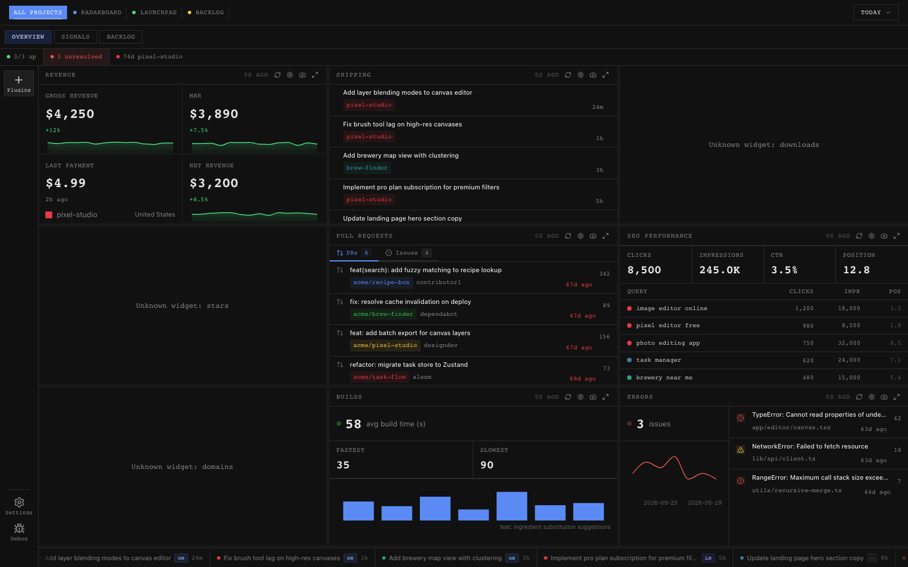
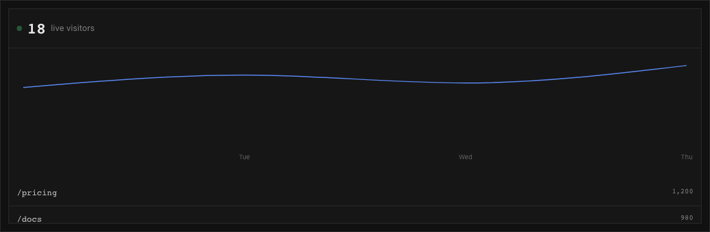

# Radarboard

<p align="center">
  
</p>

<p align="center">
  <strong>A local-first desktop board for the work you run.</strong>
</p>

<p align="center">
  Radarboard brings revenue, product analytics, incidents, releases, pull requests, sponsorship, reviews, SEO, and roadmap activity into one calm operating surface.
</p>

<p align="center">
  <a href="https://docs.radarboard.app">Documentation</a>
  ·
  <a href="https://github.com/Radarboard/radarboard/releases">Desktop beta</a>
  ·
  <a href="https://github.com/Radarboard/community-extensions">Community extensions</a>
  ·
  <a href="https://github.com/Radarboard/homebrew-radarboard">Homebrew tap</a>
</p>

<p align="center">
  <a href="https://github.com/Radarboard/radarboard/actions/workflows/ci.yml"></a>
  <a href="https://github.com/Radarboard/radarboard/actions/workflows/desktop-macos-ci.yml"></a>
  <a href="https://github.com/Radarboard/radarboard/releases"></a>
  <a href="https://docs.radarboard.app"></a>
</p>

## Why Radarboard exists

People who ship products now run a small control room by themselves: GitHub, Vercel, Stripe, RevenueCat, Sentry, OpenPanel, Linear, App Store Connect, Resend, BetterStack, Google Search Console, and a dozen other tabs.

Radarboard is the desktop layer for that work. It gives indie hackers, open-source maintainers, creators, and teams a single place to answer practical questions:

- Did revenue move?
- Did anything break?
- What shipped?
- What are users doing?
- Which issues, reviews, incidents, or roadmap items need attention?
- What changed while I was focused elsewhere?

It is intentionally local-first. Your operational data belongs on your machine first, with clear extension boundaries and predictable release infrastructure.

## What you get

| Area | Radarboard covers |
| --- | --- |
| Revenue | RevenueCat, Open Collective, Stripe, sponsorship, downloads, and subscription signals |
| Product analytics | OpenPanel sessions, visitors, page views, live activity, and trend widgets |
| Reliability | Sentry issues, BetterStack monitors, incidents, logs, alerts, and status surfaces |
| Shipping | GitHub pull requests, commits, releases, Linear work, Vercel deploys, and changelogs |
| Growth | Google Search Console queries, clicks, impressions, npm downloads, GitHub stars, and SEO cards |
| Product feedback | App Store reviews, ideas, bugs, notes, bookmarks, tasks, and roadmap views |
| Automation | MCP tools, webhook relay, extension catalogs, and SDK-backed integrations |

<p align="center">
  
</p>

## Desktop beta

The first public macOS beta is published from this repository as a GitHub prerelease.

- Release page: <https://github.com/Radarboard/radarboard/releases>
- First beta tag: `desktop-v0.1.1-beta.1`
- Release channel format: `desktop-vX.Y.Z-beta.N`
- Homebrew tap: <https://github.com/Radarboard/homebrew-radarboard>

Download the `.dmg` from the latest desktop prerelease. After the Homebrew tap sync PR is merged, beta installs are also available through:

```bash
brew tap Radarboard/radarboard https://github.com/Radarboard/homebrew-radarboard
brew install --cask radarboard-beta
```

The desktop app is built with Tauri and uses updater metadata attached to GitHub desktop releases.

## Quick start

Radarboard is a pnpm and Turborepo monorepo.

```bash
git clone https://github.com/Radarboard/radarboard.git
cd radarboard
pnpm install
pnpm dev
```

Useful local surfaces:

| Surface | URL or command |
| --- | --- |
| Dashboard app | `https://radarboard.localhost:1355` |
| Marketing site | `https://radarboard-marketing.localhost:1355` |
| Docs | `pnpm --filter @radarboard/docs dev` |
| Desktop app | `pnpm dev:desktop` |
| Storybook | `pnpm --filter @radarboard/storybook dev` |

Core checks:

```bash
pnpm lint
pnpm typecheck
pnpm test
pnpm build
pnpm docs:sdk:check
```

## Monorepo map

```text
apps/
  app/             Dashboard web app loaded by the desktop shell
  desktop/         Tauri macOS desktop app and updater configuration
  docs/            Mintlify documentation at docs.radarboard.app
  marketing/       Public website
  storybook/       Product-state stories for real app surfaces
  webhook-relay/   Local webhook relay service

integrations/      First-party service integrations
plugins/           First-party plugin surfaces
widgets/           First-party dashboard widgets

packages/
  integration-sdk/ Extension SDK for external service connectors
  plugin-sdk/      Extension SDK for product surfaces and tools
  widget-sdk/      Extension SDK for dashboard cards and panels
  ui/              Shared Radarboard UI primitives
  product/         Product naming and branding constants
  themes/          Shared design tokens

skills/            Repo-local Codex skills for creating integrations, plugins, and widgets
release-notes/     Curated desktop and package release notes
scripts/           Release, validation, catalog, and scaffolding automation
```

## Extension system

Radarboard is built around three extension types:

| Type | Directory | SDK | Purpose |
| --- | --- | --- | --- |
| Integration | `integrations/<name>/` | `@radarboard/integration-sdk` | Connect external services and expose typed data sources |
| Widget | `widgets/<name>/` | `@radarboard/widget-sdk` | Render dashboard cards, panels, metrics, and visual states |
| Plugin | `plugins/<name>/` | `@radarboard/plugin-sdk` | Add deeper product surfaces, tools, settings, and workflows |

Create a first-party extension inside this monorepo:

```bash
pnpm create-integration <name>
pnpm create-widget <name>
pnpm create-plugin <name>
pnpm check:extensions
```

Community-maintained extensions live in [`Radarboard/community-extensions`](https://github.com/Radarboard/community-extensions). Use that repository for extensions that are useful to Radarboard users but do not need to ship inside the core app.

Start here:

- [Build an integration](https://docs.radarboard.app/developer-guide/build-an-integration)
- [Build a widget](https://docs.radarboard.app/developer-guide/build-a-widget)
- [Build a plugin](https://docs.radarboard.app/developer-guide/build-a-plugin)
- [Community extension flow](https://docs.radarboard.app/developer-guide/community-extensions)
- [SDK reference](https://docs.radarboard.app/developer-guide/sdk-reference/integration-sdk)

## Release process

Radarboard uses clean GitHub releases in the `Radarboard` organization. Legacy tags and downloads are not mirrored into the fresh-history repository.

| Release surface | Source |
| --- | --- |
| Desktop macOS prerelease | `.github/workflows/desktop-macos-release.yml` |
| Desktop release notes | `release-notes/desktop-vX.Y.Z-beta.N.md` |
| Homebrew cask sync | `.github/workflows/desktop-homebrew-tap-sync.yml` |
| Public tap repo | `Radarboard/homebrew-radarboard` |
| Package changesets | `.changeset/` and `.github/workflows/changesets.yml` |

Desktop beta releases are prereleases. Stable desktop releases require Apple signing and notarization secrets.

## Contributing

Radarboard is early, but it is being set up as a real community project from the start.

Good first contribution areas:

- New widgets for common product, growth, reliability, and community signals
- Integrations for services that Radarboard users already keep open all day
- Documentation fixes, setup improvements, and examples
- Extension quality checks, SDK ergonomics, and catalog tooling
- macOS beta feedback with clear reproduction steps

Before opening a pull request:

```bash
pnpm lint
pnpm typecheck
pnpm test
pnpm build
```

For extension work, also run:

```bash
pnpm check:extensions
```

See [`CONTRIBUTING-EXTENSIONS.md`](CONTRIBUTING-EXTENSIONS.md) for extension-specific contribution rules.

## Project standards

- Use `pnpm`, not npm.
- Keep extension packages behind their SDK boundaries.
- Keep product naming centralized through `@radarboard/product`.
- Do not commit `.env*`, signing material, API keys, local databases, build output, or machine-specific MCP configuration.
- Keep docs links canonical to <https://docs.radarboard.app> and GitHub links canonical to the `Radarboard` organization.

## Security

Please do not open public issues for secrets, signing keys, credential leaks, or exploitable vulnerabilities. Report security-sensitive findings privately to the maintainers first.

The fresh-history org migration intentionally does not reintroduce local machine credentials or private MCP configuration into the public repository.

## Community

- Source: <https://github.com/Radarboard/radarboard>
- Docs: <https://docs.radarboard.app>
- Releases: <https://github.com/Radarboard/radarboard/releases>
- Community extensions: <https://github.com/Radarboard/community-extensions>
- Homebrew tap: <https://github.com/Radarboard/homebrew-radarboard>
