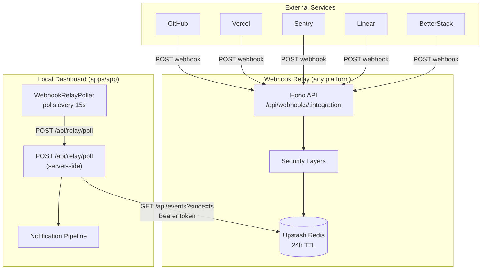
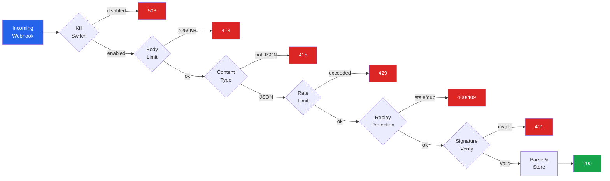
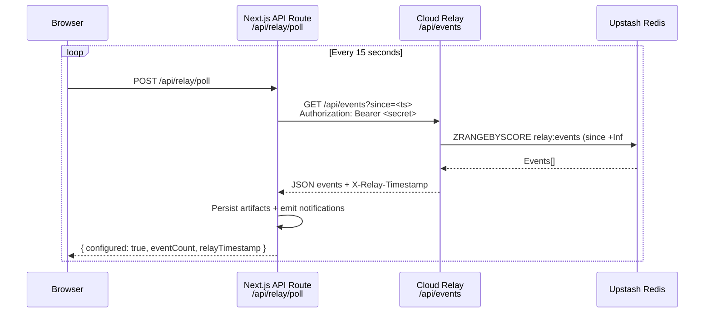
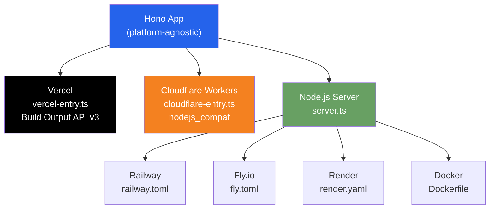
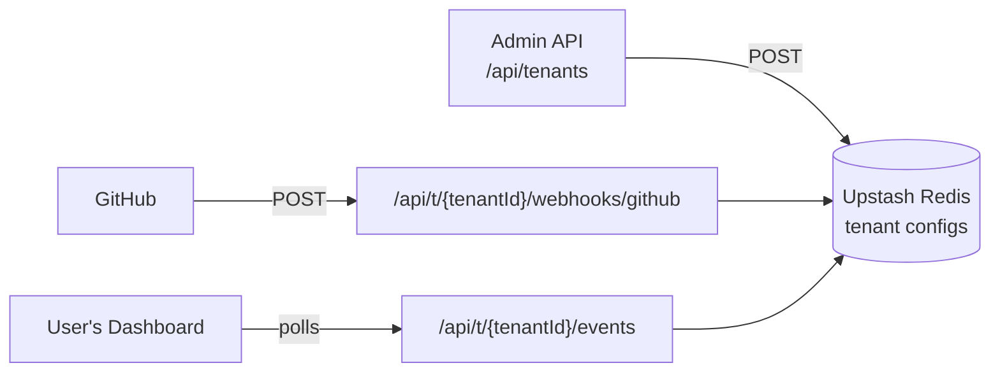

# Webhook Relay

The local dashboard cannot receive inbound webhooks from external services because it is not publicly accessible. The webhook relay solves this by running a lightweight API on Vercel that receives webhooks, verifies signatures, stores events temporarily, and lets the local dashboard poll for them.

## Why this exists

Without the relay, you need a tunnel (Tailscale Funnel, Cloudflare Tunnel) running at all times to receive webhooks locally. The relay removes that requirement:

- External services send webhooks to a permanent public URL (Vercel, Railway, Fly.io, Render, or any host)
- Events are buffered in Upstash Redis for 24 hours
- The local dashboard polls for new events every 15 seconds
- No tunnel, no port forwarding, no always-on process

For local development with tunnels, see [Local Webhook Development](/developer-guide/local-webhooks). The relay is the production alternative.

## Architecture

### High-level flow



### Security middleware pipeline

Each incoming webhook passes through these layers in order, from cheapest to most expensive. Any layer can reject the request before the next one runs.



### Polling sequence



### Deployment options



### How polling works

The local dashboard uses a client component (`<WebhookRelayPoller/>`) that calls a local API route (`POST /api/relay/poll`) every 15 seconds. The API route holds the relay secret server-side and makes the actual fetch to the cloud relay. Events are fed directly into the existing notification pipeline (`emitNotificationEvents`).

This design means:

- The relay poll secret is never exposed to the browser
- The local dashboard only makes outbound HTTPS requests (no inbound ports needed)
- If the relay is unreachable, the dashboard continues working — polling silently retries
- If `WEBHOOK_RELAY_URL` is not set, the poller detects `{ configured: false }` on the first call and stops

## Setup

### 1. Create an Upstash Redis database

1. Go to [Upstash Console](https://console.upstash.com/)
2. Create a new Redis database (the free tier is sufficient)
3. Note the **REST URL** and **REST Token** — you will need them for any platform

If you deploy to Vercel, the [Upstash Vercel Integration](https://vercel.com/integrations/upstash) can provision these automatically.

### 2. Deploy the relay

The webhook relay can be deployed to any platform that runs Node.js, Docker containers, or edge runtimes. Choose the platform that works best for you.

<Tabs>
  <Tab title="Vercel">
    **Option A — Vercel CLI:**

    ```bash
    cd apps/webhook-relay
    vercel
    ```

    **Option B — Connect the monorepo:**

    1. Import the repository in the [Vercel Dashboard](https://vercel.com/new)
    2. Set **Root Directory** to `apps/webhook-relay`
    3. Vercel will detect the `vercel.json` and build automatically

    **Option C — Install the Upstash integration:**

    Add the [Upstash Vercel Integration](https://vercel.com/integrations/upstash) to auto-provision `KV_REST_API_URL` and `KV_REST_API_TOKEN`.
  </Tab>

  <Tab title="Railway">
    1. Create a new project in [Railway](https://railway.com/new)
    2. Connect your repository
    3. Set **Root Directory** to `/` (Railway needs access to the monorepo root for the Dockerfile)
    4. Railway will detect the `Dockerfile` at `apps/webhook-relay/Dockerfile`
    5. Set environment variables in the Railway dashboard (see table below)

    Railway auto-assigns a public URL. Use it as your relay URL.

    The included `railway.toml` configures health checks on `/api/health`.
  </Tab>

  <Tab title="Fly.io">
    ```bash
    # From the repo root
    fly launch --dockerfile apps/webhook-relay/Dockerfile
    fly secrets set KV_REST_API_URL=<your-upstash-url>
    fly secrets set KV_REST_API_TOKEN=<your-upstash-token>
    fly secrets set RELAY_POLL_SECRET=$(openssl rand -hex 32)
    ```

    The included `fly.toml` configures a minimal 256MB VM with auto-stop (scales to zero when idle).

    Your relay URL will be `https://<app-name>.fly.dev`.
  </Tab>

  <Tab title="Render">
    1. Create a new **Web Service** in [Render](https://render.com/)
    2. Connect your repository
    3. Set **Dockerfile Path** to `apps/webhook-relay/Dockerfile` and **Docker Context** to `.`
    4. Set environment variables in the Render dashboard

    The included `render.yaml` Blueprint can also be used with `render blueprint sync`.

    Your relay URL will be `https://<service-name>.onrender.com`.
  </Tab>

  <Tab title="Cloudflare Workers">
    ```bash
    cd apps/webhook-relay
    pnpm build:cloudflare
    wrangler deploy
    ```

    Set secrets with `wrangler secret put`:

    ```bash
    wrangler secret put KV_REST_API_URL
    wrangler secret put KV_REST_API_TOKEN
    wrangler secret put RELAY_POLL_SECRET
    ```

    The included `wrangler.toml` enables `nodejs_compat` for Node.js crypto APIs used by signature verification.

    Your relay URL will be `https://radarboard-webhook-relay.<your-subdomain>.workers.dev`.
  </Tab>

  <Tab title="Docker (self-hosted)">
    ```bash
    # From the repo root
    docker build -f apps/webhook-relay/Dockerfile -t webhook-relay .
    docker run -p 8787:8787 \
      -e KV_REST_API_URL=<your-upstash-url> \
      -e KV_REST_API_TOKEN=<your-upstash-token> \
      -e RELAY_POLL_SECRET=<your-secret> \
      webhook-relay
    ```

    Or use the standalone build without Docker:

    ```bash
    cd apps/webhook-relay
    pnpm build:standalone
    PORT=8787 node dist/server.js
    ```
  </Tab>
</Tabs>

### 3. Configure environment variables

Set these on whichever platform you chose above.

| Variable | Required | Description |
|----------|----------|-------------|
| `KV_REST_API_URL` | Yes | Upstash Redis REST endpoint. |
| `KV_REST_API_TOKEN` | Yes | Upstash Redis auth token. |
| `RELAY_POLL_SECRET` | Yes | Shared secret the local dashboard uses to authenticate poll requests. Generate with `openssl rand -hex 32`. |
| `WEBHOOK_SECRET_GITHUB` | Per integration | Secret configured in your GitHub webhook settings. |
| `WEBHOOK_SECRET_VERCEL` | Per integration | Signing secret shown when creating a Vercel webhook. |
| `WEBHOOK_SECRET_SENTRY` | Per integration | Client secret from your Sentry internal integration. |
| `WEBHOOK_SECRET_LINEAR` | Per integration | Signing secret from Linear webhook settings. |
| `WEBHOOK_SECRET_BETTERSTACK` | Per integration | Shared token you set in your BetterStack webhook. |
| `SENTRY_DSN` | No | Sentry DSN for error monitoring of the relay itself. |
| `ALLOWED_ORIGIN` | No | Restricts CORS on the poll endpoint. Not needed if your dashboard polls server-to-server. |
| `RELAY_ENABLED` | No | Set to `false` to globally disable all webhook ingestion. Defaults to enabled. |
| `RELAY_DISABLE_GITHUB` | No | Set to `true` to disable GitHub webhooks only. Works for any integration: `RELAY_DISABLE_VERCEL`, etc. |

You only need to set secrets for the integrations you actually use.

<Tip>
**Secret rotation**: Webhook secret env vars support comma-separated values for zero-downtime rotation. Set `WEBHOOK_SECRET_GITHUB=new-secret,old-secret` and the relay will try both keys until one matches. Remove the old key after all in-flight deliveries have completed.
</Tip>

### 4. Configure the local dashboard

**Step A — Set the poll secret in env:**

Add to your `apps/app/.env.local`:

```bash
RELAY_POLL_SECRET=<same-secret-as-relay>
```

**Step B — Set the relay URL in dashboard settings:**

Open the dashboard, go to **Settings > Integrations**, and enter your relay URL in the **Webhook Relay** section. Examples:

- Vercel: `https://your-relay.vercel.app`
- Railway: `https://your-relay.up.railway.app`
- Fly.io: `https://your-relay.fly.dev`
- Render: `https://your-relay.onrender.com`
- Cloudflare: `https://radarboard-webhook-relay.your-subdomain.workers.dev`
- Self-hosted: `https://relay.yourdomain.com`

The relay URL is stored in the database so it can be changed without restarting the dashboard. The `<WebhookRelayPoller/>` component will start polling automatically once both the URL and secret are configured.

### 5. Point external services to the relay

Configure each service's webhook settings to point at your relay URL instead of your local machine.

## Per-integration webhook configuration

Each integration has its own signing mechanism. The relay reuses the existing webhook handlers from `packages/integrations/src/*/events/webhook.ts` — the same code that powers the local `/api/webhooks/[integration]` route.

### GitHub

| Setting | Value |
|---------|-------|
| **Webhook URL** | `https://your-relay.vercel.app/api/webhooks/github` |
| **Content type** | `application/json` |
| **Secret** | A random string you generate. Set as `WEBHOOK_SECRET_GITHUB` on Vercel. |
| **Signing method** | HMAC-SHA256 |
| **Signature header** | `X-Hub-Signature-256` (format: `sha256=<hex>`) |

**Where to configure**: Repository → Settings → Webhooks → Add webhook

**Docs**: [Validating webhook deliveries](https://docs.github.com/en/webhooks/using-webhooks/validating-webhook-deliveries)

**Events supported**: `pull_request`, `issues`, `release`, `deployment_status`, `star`

### Vercel

| Setting | Value |
|---------|-------|
| **Webhook URL** | `https://your-relay.vercel.app/api/webhooks/vercel` |
| **Signing method** | HMAC-SHA1 |
| **Signature header** | `x-vercel-signature` (format: raw hex) |

**Where to configure**: Project → Settings → Webhooks

**Important**: Vercel displays the signing secret only once when you create the webhook. Copy it immediately and set it as `WEBHOOK_SECRET_VERCEL`.

**Docs**: [Vercel Webhooks](https://vercel.com/docs/webhooks)

**Events supported**: `deployment.created`, `deployment.succeeded`, `deployment.error`

### Sentry

| Setting | Value |
|---------|-------|
| **Webhook URL** | `https://your-relay.vercel.app/api/webhooks/sentry` |
| **Signing method** | HMAC-SHA256 |
| **Signature header** | `sentry-hook-signature` (format: raw hex) |

**Where to configure**: Settings → Developer Settings → Internal Integrations → Create/Edit

**Important**: Sentry webhook signing is only available through **Internal Integrations**, not through the legacy "Webhooks" plugin. You must create an Internal Integration and use its **Client Secret** as `WEBHOOK_SECRET_SENTRY`.

**Docs**: [Sentry Webhooks (Integration Platform)](https://docs.sentry.io/organization/integrations/integration-platform/webhooks/)

**Events supported**: `issue.created`, `issue.resolved`, `error.created`

### Linear

| Setting | Value |
|---------|-------|
| **Webhook URL** | `https://your-relay.vercel.app/api/webhooks/linear` |
| **Signing method** | HMAC-SHA256 |
| **Signature header** | `Linear-Signature` (format: raw hex) |

**Where to configure**: Settings → API → Webhooks → New webhook

**Docs**: [Linear Webhooks](https://linear.app/developers/webhooks)

**Events supported**: `Issue` (created, updated, removed), `Comment`, `Project`

### BetterStack

| Setting | Value |
|---------|-------|
| **Webhook URL** | `https://your-relay.vercel.app/api/webhooks/betterstack` |
| **Signing method** | Shared token (not HMAC) |
| **Token header** | `x-betterstack-token` or `Authorization: Bearer <token>` |

**Where to configure**: Monitoring → Integrations → Webhook → Edit

**Important**: BetterStack does **not** support HMAC signature verification. Instead, our handler checks for a shared token in the `x-betterstack-token` header (or `Authorization: Bearer` header). You must configure your BetterStack webhook to include this token. Set the same value as `WEBHOOK_SECRET_BETTERSTACK` on Vercel.

<Warning>
Because BetterStack does not sign payloads, the relay relies on token comparison only. This is less secure than HMAC. The rate limiter and replay protection provide additional defense, but treat this integration's secret with extra care.
</Warning>

**Docs**: [BetterStack Outgoing Webhooks](https://betterstack.com/docs/uptime/webhooks/)

**Events supported**: Monitor status changes (up/down), incidents

## Relay API endpoints

### `POST /api/webhooks/:integration`

Receives webhooks from external services.

| Step | Description |
|------|-------------|
| Kill switch | Rejects immediately if `RELAY_ENABLED=false` or `RELAY_DISABLE_<INTEGRATION>=true` (503) |
| Body limit | Rejects payloads larger than 256 KB (413) |
| Content-Type | Rejects requests without `application/json` Content-Type (415) |
| Rate limit | 100 requests/min per IP per integration (429) |
| Replay check | Rejects duplicate delivery IDs and payloads older than 5 minutes (409) |
| Signature verify | Tries each configured secret (supports rotation). Delegates to the integration's `verifySignature()` handler (401) |
| Parse payload | Delegates to the integration's `parsePayload()` handler (400) |
| Store | Writes events to an Upstash Redis sorted set |

Returns `{ received: true, eventCount: N }` on success.

### `GET /api/events?since=<ms>&limit=<n>`

Poll endpoint for the local dashboard.

| Parameter | Default | Description |
|-----------|---------|-------------|
| `since` | now - 60s | Timestamp in milliseconds. Returns events received at or after this time. |
| `limit` | 100 | Maximum events to return. Capped at 500. |

Requires `Authorization: Bearer <RELAY_POLL_SECRET>` header.

Returns a JSON array of relay events. Includes `X-Relay-Timestamp` response header for clock-skew-safe pagination — the local poller uses this value as the `since` parameter for the next poll.

### `GET /api/health`

Returns `{ status: "ok", timestamp: <ms> }`. No authentication required.

## Security model

The relay applies multiple defense layers in order, from cheapest to most expensive. Each layer can independently reject a request before the next layer runs.

### Kill switch

Instantly disable all webhook ingestion or specific integrations without redeploying:

- **Global**: Set `RELAY_ENABLED=false` to reject all webhooks with `503 Service Unavailable`
- **Per-integration**: Set `RELAY_DISABLE_GITHUB=true` (or any integration name) to disable that integration only

The poll endpoint is **not** affected — the dashboard can still drain buffered events after the kill switch is flipped.

### Body size limit

Rejects payloads larger than 256 KB with `413 Payload Too Large`. This prevents memory abuse and Redis bloat from oversized bodies. All supported webhook providers send payloads well under this limit.

### Content-Type validation

Rejects requests without `application/json` Content-Type with `415 Unsupported Media Type`. All supported webhook providers send JSON payloads.

### Rate limiting

Uses Upstash Ratelimit with a sliding window algorithm:

- **Webhook routes**: 100 requests/minute per IP per integration
- **Poll route**: 20 requests/minute per IP

Returns `429 Too Many Requests` with a `Retry-After` header when exceeded.

### Replay protection

Two complementary strategies:

1. **Delivery ID dedup**: Stores processed delivery IDs in Redis with a 5-minute TTL. If the same delivery ID arrives again, returns `409 Conflict`.
2. **Timestamp freshness**: For integrations that include a timestamp header (Sentry), rejects payloads older than 5 minutes.

Delivery ID headers per integration:

| Integration | Header |
|-------------|--------|
| GitHub | `X-GitHub-Delivery` |
| Vercel | `X-Vercel-Delivery` |
| Sentry | `sentry-hook-resource` |
| Linear | `linear-delivery` |
| BetterStack | `x-betterstack-delivery` |

### Signature verification

Four of five integrations use HMAC signature verification. The relay delegates to the same handler code that the local dashboard uses (`packages/integrations/src/*/events/webhook.ts`). All HMAC comparisons use constant-time XOR to prevent timing attacks.

BetterStack uses shared token comparison (also constant-time) since it does not support HMAC signing.

### Secret rotation

Webhook secret env vars support comma-separated values for zero-downtime rotation. When multiple secrets are configured (e.g. `WEBHOOK_SECRET_GITHUB=new-secret,old-secret`), the relay tries each key in order until one matches. This allows you to:

1. Add the new secret alongside the old one
2. Update the external service to use the new secret
3. Remove the old secret after all in-flight deliveries have completed

No requests are rejected during the rotation window.

### Event expiration

Events older than 24 hours are pruned from Redis on each poll request.

### Sentry error monitoring

If `SENTRY_DSN` is configured, unhandled errors in the relay are captured with full request context (integration name, route, headers). This is for monitoring the relay itself, not the external services.

## CI pipeline

The relay has a GitHub Actions workflow at `.github/workflows/webhook-relay-ci.yml` that runs on pushes to `main` and pull requests affecting the relay or its dependencies:

- Typecheck
- Lint (Biome)
- Unit tests (Vitest, 22 tests)
- Build

## Project structure

```
apps/webhook-relay/
├── src/
│   ├── index.ts              # Hono app setup, middleware, route mounting
│   ├── vercel-entry.ts       # Vercel/serverless entry
│   ├── cloudflare-entry.ts   # Cloudflare Workers entry
│   ├── lib/
│   │   ├── env.ts            # Centralized env var access
│   │   ├── store.ts          # Upstash Redis event storage (sorted set)
│   │   ├── auth.ts           # Bearer token verification (timing-safe)
│   │   └── sentry.ts         # Sentry init + error middleware
│   ├── middleware/
│   │   ├── rate-limit.ts     # Upstash Ratelimit (sliding window)
│   │   └── replay-protection.ts  # Delivery ID dedup + timestamp check
│   ├── routes/
│   │   ├── webhooks.ts       # POST /api/webhooks/:integration
│   │   ├── events.ts         # GET /api/events
│   │   └── health.ts         # GET /api/health
│   └── __tests__/
│       ├── store.test.ts
│       ├── auth.test.ts
│       ├── webhooks.test.ts
│       └── events.test.ts
├── scripts/
│   └── test-webhook.sh       # Manual integration test
├── package.json
├── tsconfig.json
├── vercel.json
└── vitest.config.ts
```

## Dashboard integration files

| File | Description |
|------|-------------|
| `apps/app/lib/webhook-relay-poller.ts` | Server-side polling logic — fetches from relay, emits notification events |
| `apps/app/app/api/relay/poll/route.ts` | API route — secure bridge between browser and cloud relay |
| `apps/app/components/webhook-relay-poller.tsx` | Client component — drives the 15s polling interval |

## Manual testing

Use the included shell script to send a signed test webhook and verify it appears in the poll response:

```bash
RELAY_URL=https://your-relay.vercel.app \
RELAY_POLL_SECRET=your-secret \
WEBHOOK_SECRET_GITHUB=your-github-secret \
bash apps/webhook-relay/scripts/test-webhook.sh
```

The script computes an HMAC-SHA256 signature locally, sends a test GitHub `pull_request` payload, waits 1 second, then polls for the event and verifies it appears.

## Managed relay (multi-tenant)

The managed relay at `relay.radarboard.app` hosts webhook ingestion for multiple users. Each user gets an isolated tenant with their own webhook URLs, secrets, and event store.

### How it works



Each tenant is fully isolated:
- **Events**: `relay:{tenantId}:events` — no cross-tenant data leakage
- **Rate limits**: `rl:webhook:{tenantId}:{ip}:{integration}` — per-tenant limits
- **Replay protection**: `relay:{tenantId}:dedup:*` — per-tenant dedup
- **Secrets**: stored in Redis per tenant, not in env vars

### Tenant provisioning

All tenant management requires the `RELAY_ADMIN_SECRET` for authorization.

**Create a tenant:**

```bash
curl -X POST https://relay.radarboard.app/api/tenants \
  -H "Authorization: Bearer $RELAY_ADMIN_SECRET" \
  -H "Content-Type: application/json" \
  -d '{"label": "Acme Corp"}'
```

Response:
```json
{
  "tenant": { "id": "a1b2c3d4", "createdAt": 1711324800000, "label": "Acme Corp" },
  "pollSecret": "generated-uuid",
  "webhookBaseUrl": "/api/t/a1b2c3d4/webhooks",
  "pollUrl": "/api/t/a1b2c3d4/events"
}
```

**Set webhook secrets for the tenant:**

```bash
curl -X PUT https://relay.radarboard.app/api/tenants/a1b2c3d4/secrets \
  -H "Authorization: Bearer $RELAY_ADMIN_SECRET" \
  -H "Content-Type: application/json" \
  -d '{"webhookSecrets": {"github": "their-github-secret", "vercel": "their-vercel-secret"}}'
```

**List all tenants:**

```bash
curl https://relay.radarboard.app/api/tenants \
  -H "Authorization: Bearer $RELAY_ADMIN_SECRET"
```

**Delete a tenant (removes all data):**

```bash
curl -X DELETE https://relay.radarboard.app/api/tenants/a1b2c3d4 \
  -H "Authorization: Bearer $RELAY_ADMIN_SECRET"
```

### Connecting a tenant's dashboard

The user sets their relay URL in **Settings > Integrations > Webhook Relay**:

```
https://relay.radarboard.app/api/t/a1b2c3d4
```

And sets `RELAY_POLL_SECRET` in their `apps/app/.env.local` to the `pollSecret` returned at provisioning.

The dashboard's poller appends `/events?since=...` automatically — it doesn't know or care that it's hitting a multi-tenant relay.

### Environment variables (managed deployment)

| Variable | Required | Description |
|----------|----------|-------------|
| `KV_REST_API_URL` | Yes | Upstash Redis REST endpoint |
| `KV_REST_API_TOKEN` | Yes | Upstash Redis auth token |
| `RELAY_ADMIN_SECRET` | Yes | Admin secret for tenant provisioning API |
| `RELAY_POLL_SECRET` | Yes | Fallback poll secret for single-tenant mode |
| `ALLOWED_ORIGIN` | Recommended | Restrict CORS on events endpoint |
| `SENTRY_DSN` | No | Error monitoring |

Webhook secrets are **not** set as env vars in managed mode — they're stored per-tenant in Redis via the provisioning API.

## Troubleshooting

### Relay returns `401` on webhook

- Verify the webhook secret env var is set on Vercel for that integration
- Check the secret matches exactly what the external service is using to sign
- For Sentry: make sure you are using an Internal Integration, not the legacy webhooks plugin

### Relay returns `404` on webhook

- Check the integration name in the URL path matches one of: `github`, `vercel`, `sentry`, `linear`, `betterstack`

### Relay returns `429`

- Rate limit exceeded. The response includes a `Retry-After` header. External services will typically retry automatically.

### Dashboard not receiving events

1. Check `WEBHOOK_RELAY_URL` and `RELAY_POLL_SECRET` are set in `apps/app/.env.local`
2. Check the relay is deployed and `/api/health` returns `200`
3. Check the browser console for network errors on `/api/relay/poll`
4. Try the manual test script to verify events reach the relay

### Events appear in relay but not in notifications

- The notification system has its own preferences, quiet hours, and rules. Check the Notification settings page.
- Events are deduplicated by `sourceEventId` — the same event will not produce duplicate notifications.

### Relay health but Redis errors

- If using the Upstash Vercel integration, check the integration is still linked in your Vercel project settings
- Check the Upstash console for database status and quota usage
